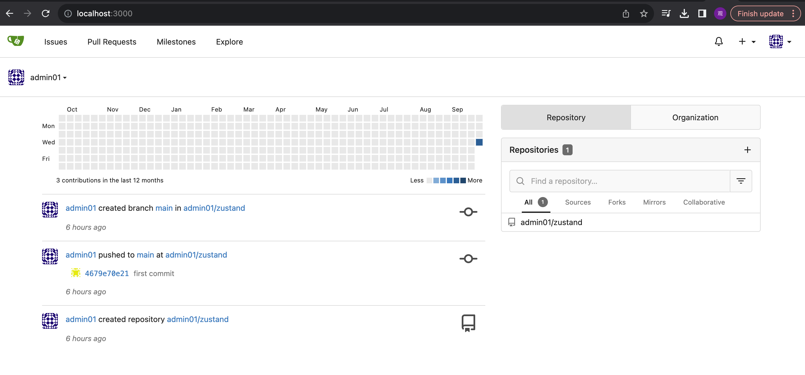
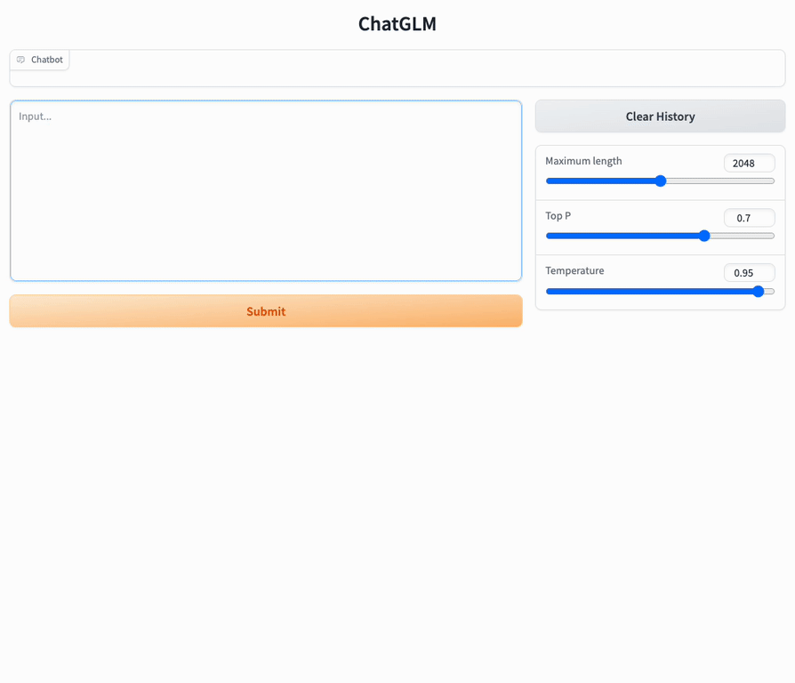

CRCopilot 是一个基于 LLM 大语言模型且完全免费的 Code Review 系统。

基于 Docker 部署。


### git服务
http://localhost:3000/



### WebUI

可以通过以下命令启动基于 Gradio 的网页版 demo：
```shell
python web_demo.py
```

### API 部署
首先需要安装额外的依赖 `pip install fastapi uvicorn`，然后运行仓库中的 [api.py](api.py)：
```shell
python api.py
```
默认部署在本地的 8000 端口，通过 POST 方法进行调用
```shell
curl -X POST "http://127.0.0.1:8000" \
     -H 'Content-Type: application/json' \
     -d '{"prompt": "你好", "history": []}'
```
得到的返回值为
```shell
{
  "response":"你好👋！我是人工智能助手 ChatGLM2-6B，很高兴见到你，欢迎问我任何问题。",
  "history":[["你好","你好👋！我是人工智能助手 ChatGLM2-6B，很高兴见到你，欢迎问我任何问题。"]],
  "status":200,
  "time":"2023-03-23 21:38:40"
}
```